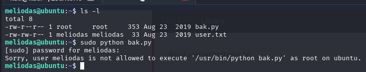

# Library

Máquina boot2root para FIT y bsides guatemala CTF

# 1. Library

Lo primero es escanear los puertos.

```bash

nmap  <IP_MAQUINA>

```


Vemos que los puertos abiertos son **ssh** y **http**.

Vamos a aprovechar que esta el puerto http abierto para ver si encontramos algo con la ip.


Vemos que hay una web.

El primer post nos da el nombre de usuario asi que ya tenemos por donde tirar.


El usuario es **meliodas**.

Tambien es interesante hacer un fuzz para ver rutas ocultas.


Como vemos, no hay nada interesante.

Hasta ahora solo tenemos el nombre de usuario, la ip de la maquina y los puertos abiertos.

Vamos a entrar por ssh a la maquina con el usuario que tenemos, pero antes tengo que ver cual es su contraseña, para esto, usare **hydra**.

```bash

hydra -l meliodas -P /rutaHaciaRockyou.txt <IP_MAQUINA> ssh

```


Vemos que la contraseña del usuario es **iloveyou1**.

Ya tenemos todo lo necesario para conectarnos por ssh.


Una vez dentro, vamos a comprobar los archivos que hay.

Hacemos cat a user.txt y tenemos la primera flag.


Pasamos a la parte de root.

Vamos a mirar los archivos que se pueden ejecutar con root.

```bash

sudo -l

```


Vemos que el archivo bak.py.



Comprobamos que no se puede ejecutar con nuestros permisos actuales.

El codigo del archivo es el siguiente.


Como no lo podemos editar, vamos a borrarlo y crearlo de nuevo.

```bash

rm bak.py

nano bak.py

```

Ponemos la root shell.


Y al ejecutarla tendremos acceso a root.

```bash

sudo /usr/bin/python /home/meliodas/bak.py

```


Una vez dentro accedemos a la carpeta root y ahi se encuentra la flag.


